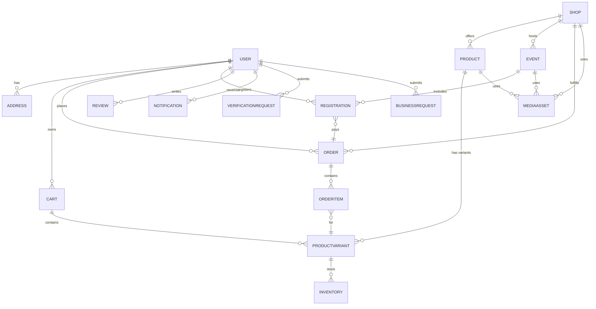

# Manacity 4.0 Entity-Relationship Design

## Identification & Soft Delete
- All collections use MongoDB `ObjectId` as the primary key.
- Soft deletes are handled via a nullable `deletedAt` timestamp field; queries filter out documents where `deletedAt` is not `null`.
- Slugs are generated from names for `Shop`, `Product`, and `Event` and stored in a unique `slug` field for human‑readable URLs.

## Enumerations
- **Roles:** `customer`, `business`, `verified`, `admin`
- **OrderStatus:** `pending`, `accepted`, `cancelled`, `completed`
- **PaymentStatus (future):** `unpaid`, `paid`, `refunded`
- **EventStatus:** `upcoming`, `active`, `ended`, `cancelled`
- **VerificationStatus:** `pending`, `approved`, `rejected`
- **BusinessRequestStatus:** `pending`, `approved`, `rejected`

## Entity Relationship Diagram

## Top Access Patterns & Index Plan
| # | Access pattern | Suggested index | Rationale |
|---|----------------|-----------------|-----------|
| 1 | Find user by phone | `{ phone: 1 }` unique | Login lookup |
| 2 | List addresses for user | `{ userId: 1 }` | Frequent user detail lookup |
| 3 | Fetch shop by slug | `{ slug: 1 }` unique | Public shop pages |
| 4 | Query products by shop & slug | `{ shopId: 1, slug: 1 }` unique | Product pages within a shop |
| 5 | Search products by text | text index on `name`, `description` | Keyword search |
| 6 | List variants for product | `{ productId: 1 }` | Building product detail page |
| 7 | Check inventory for variant | `{ variantId: 1 }` | Real‑time stock check |
| 8 | Load cart for user | `{ userId: 1 }` | Checkout flow |
| 9 | Fetch order history by user | `{ userId: 1, createdAt: -1 }` | Order list sorted by date |
|10 | Fetch order by number | `{ orderNumber: 1 }` unique | Customer service lookup |
|11 | List items for order | `{ orderId: 1 }` | Order detail view |
|12 | Query orders by status | `{ status: 1, createdAt: -1 }` | Admin dashboards |
|13 | Lookup event by slug | `{ slug: 1 }` unique | Event landing pages |
|14 | Upcoming events for shop | `{ shopId: 1, status: 1, startDate: 1 }` | Event listing |
|15 | Check registration for user & event | `{ eventId: 1, userId: 1 }` unique | Prevent duplicate signups |
|16 | Notifications for user | `{ userId: 1, createdAt: -1 }` | Notification feed |
|17 | Verification requests by status | `{ status: 1, createdAt: -1 }` | Admin review |
|18 | Business requests by status | `{ status: 1, createdAt: -1 }` | Admin review |
|19 | Reviews for product | `{ productId: 1, createdAt: -1 }` | Product detail page |
|20 | Media assets for entity | `{ ownerType: 1, ownerId: 1 }` | Loading images/files |

This design covers current features while leaving space for future growth such as payment tracking and additional user roles.
